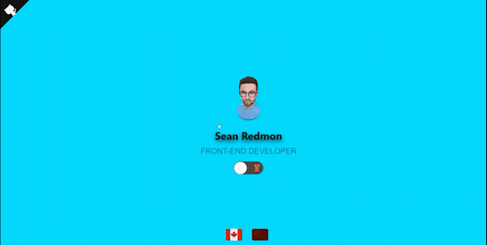
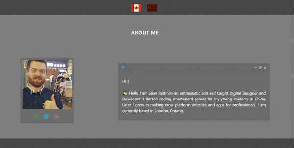
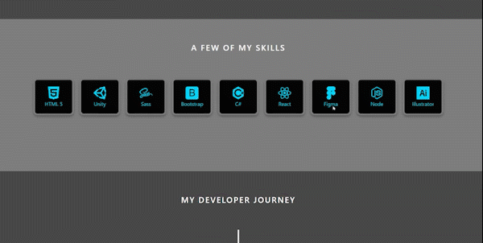
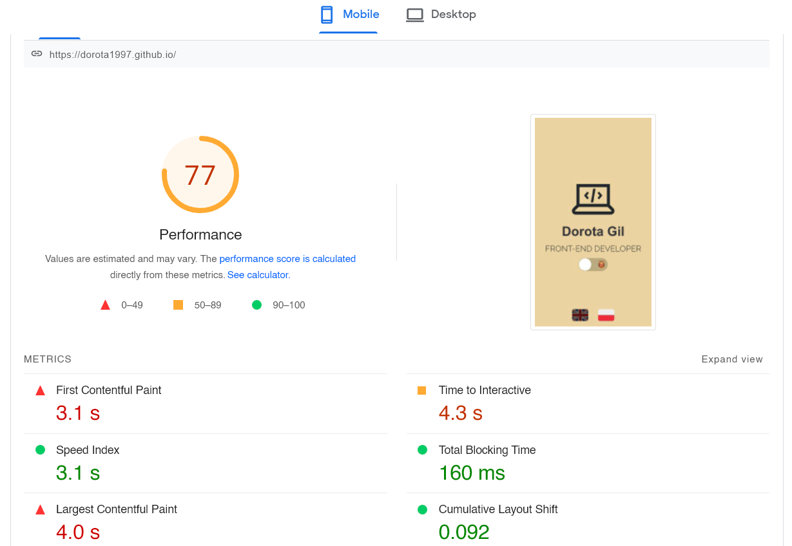
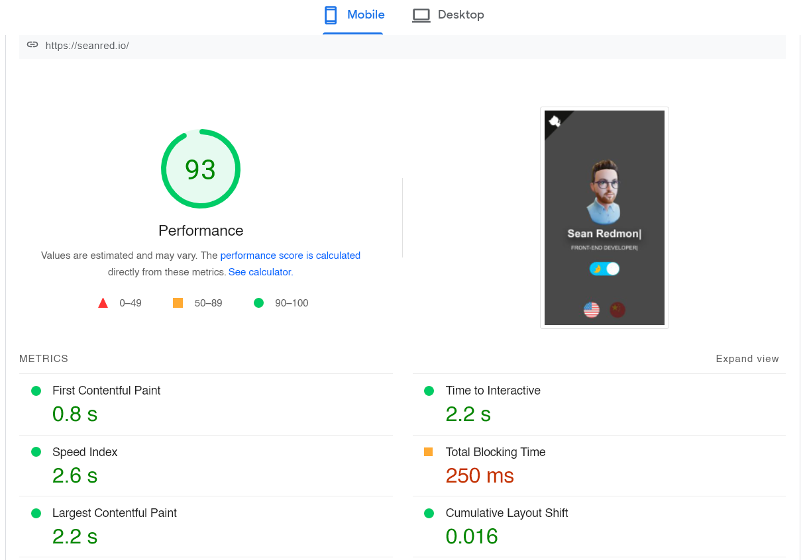
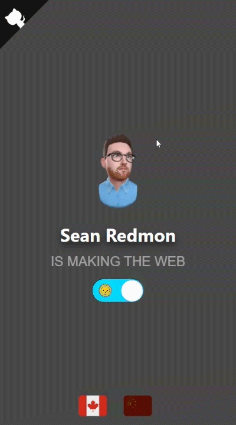
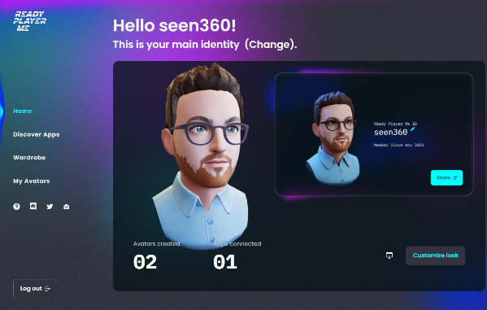

# seanred.io

This is a portfolio website for Sean Redmon, the Software developer.
<br/>
<br/>
 &nbsp;  &nbsp;  &nbsp;  &nbsp;  &nbsp; 

## Table of contents

- [Overview](#overview)
  - [User Stories](#user-stories)
  - [Screenshots](#screenshots)
  - [Links](#links)
- [My process](#my-process)
  - [Built with](#built-with)
  - [What I learned](#what-i-learned)
  - [Continued development](#continued-development)
- [Author](#author)
- [Acknowledgments](#acknowledgments)

## Overview

### User Stories

Users should be able to:

- See Sean's projects as easily and as quickly as possible.
- Go to the live project sites.
- See a summary or bio of who Sean is.
- View the site in English or Chinese language.
- Change between a light and dark theme.
- See Sean's qualifications in a timeline format.
- Find Sean's Github profile.
- Contact Sean.
- View the site on any device or screen size.

### Screenshots






### Links

- GitHub URL: [https://github.com/seanred360/sean-red-portfolio]
- Live Site URL: [https://seanred.io]

## My process

### Built with

- [React](https://reactjs.org/) - JS library
- [ThreeJS](https://threejs.org/) - For the 3D head avatar
- [React Three Fiber](https://github.com/pmndrs/react-three-fiber) - Makes ThreeJS into components for React
- [styled components](https://styled-components.com/) - Used to make swappable color variables for the light/dark themes
- [Github Pages](https://pages.github.com/) - For hosting
- [SASS](https://sass-lang.com/) - For writing stylesheets that are organized and maintainable

### What I learned

I began with [Dorota1997](https://github.com/Dorota1997/react-frontend-dev-portfolio)'s portfolio template. It had everything I wanted in a portfolio website. It was visually appealing and simple to navigate. It showed a bio, project, and timeline section. After looking at the code, I quickly noticed that the stylesheet was a mess and really difficult to change. I did my best to break the 1000s of lines into organized SCSS stylesheets. I also replaced the theme switcher system with my own, made with styled components (The old style switcher did not remember the user's preference between refreshes). This ended up taking me longer than I would have spent coding from scratch. Going forward it is absolutely necessary to organize all my stylesheets and have meaningful names for my elements. If any changes need to be made it will be much quicker if we can find what we are looking for. It will keep other developers from going mad looking through the spaghetti code. So I reached out to the developers and offered my changes. After a polite back and fourth they decided there were too many changes in one commit to go through. I learned another lesson here. My commits should be as small and as descriptive as possible so that anyone reviewing them can quickly see where changes were made.

#### Performance improvements with NextJs




I recreated the entire page using NextJs and scss modules to get a pretty sizable performance boost. Speed is everything when a potential employer or client is looking at your page. If the page doesn't load in under 4 seconds, the user will often click away or think that something isn't working correctly. My NextJs site loads about 17 sconds faster than my React version of the same site. The NextJs site loads about twice as fast as Dorota1997's original website template. NextJs prerenders the HTML for every page at build time. This is much faster than the React way of having the client render the it. Having the HTML already rendered also allows bots to crawl the page correctly, which improves search engine optimization. CSS and SCSS modules help NextJs code split more efficiently which means better load times.

#### Creating a 3D avatar




I wanted something visually unique to grab the user's attention. For this I found [ThreeJS](https://threejs.org/), an awesome library that can render 3d models in the browser! What good is a renderer without a model to render? [Ready Player Me](https://readyplayer.me/) can generate a high quality rigged GLTF model in minutes! After reading the ThreeJS documentation, I was able to render my avatar in the browser. Initially I made the avatar very large and high quality, this was very resource intensive and made the user's computer struggle, and increased load times significantly. After scaling down the model's size, another problem arose. A stationary model is boring! It should be interactive and animated. Luckily I found [egemenertugrul](https://github.com/egemenertugrul/wolf3d-readyplayerme-threejs-boilerplate) who came up with a brilliant way to have the avatar follow your mouse. Unfortunantly, his solution did not work in React because React needs functions to be in a component to sync with the DOM and virtual DOM properly. So I had to reverse engineer his code and make a React component with hooks.

```js
const Avatar3d = () => {
  const { createResizeHandler } = require("../avatar3d/utils");

  async function startApplication() {
    const container = createDefaultContainer();
    const renderer = createDefaultRenderer();
    const scene = createDefaultScene();
    const camera = createDefaultCamera();
    const clock = new Clock();

    container.appendChild(renderer.domElement);

    createResizeHandler({ renderer, camera });

    preloader.init(...resolvers);
    await preloader.load([defaultAvatar]);

    const avatar = Avatar.createDefault(renderer);
    scene.withAvatar(avatar);

    function render() {
      window.requestAnimationFrame(render);
      renderer.clear();
      renderer.render(scene.main, camera);

      const delta = clock.getDelta();
      scene.main.traverse((element) => element?.update?.(delta));
    }

    render();
  }

  useEffect(() => {
    startApplication();
  }, []);

  return <div id="3d_avatar"></div>;
};
```

### Continued development

I will remake this website many times throughout my career. I think I will always want to try a new design because there are so mny possibilities. This is my first attempt, so I wanted the site to be small and user friendly. I will take a risk and do a more non standard design in the future. The next design will most likely have something visually stunning and use ThreeJS or AnimeJS. Perhaps the website will scroll horizontally or have some other non standard design.

## Author

- Website - [seanred.io](https://seanred.io)
- GitHub - [seanred360](https://github.com/seanred360)

## Acknowledgments

- [trolit](https://github.com/trolit) - for critiquing my pull request and teaching me the advantages of PX vs REM units
- [Dorota1997](https://github.com/Dorota1997/react-frontend-dev-portfolio)
- [egemenertugrul](https://github.com/egemenertugrul/wolf3d-readyplayerme-threejs-boilerplate)
- [React Vertical Timeline](https://github.com/stephane-monnot/react-vertical-timeline)
- [React Awesome Slider](https://github.com/rcaferati/react-awesome-slider)
- [React Switch](https://github.com/markusenglund/react-switch)
- [React Typical](https://github.com/catalinmiron/react-typical)
- [Iconify Design](https://iconify.design/icon-sets/?query=angular)
- [Polaroid effect](https://www.w3docs.com/snippets/css/how-to-create-polaroid-image-with-css.html#)
- [GitHub Ref Corner](https://tholman.com/github-corners)
